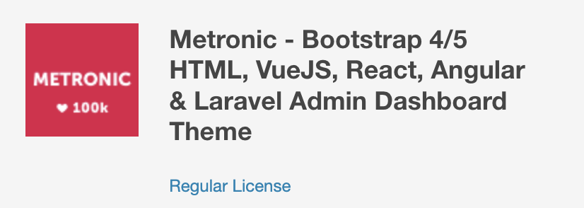

# Chihiro Develop Kit

## Initial Setting

### install nodeenv for mac

```bash
brew install nodeenv
```

### create nodeenv

```bash
nodeenv --node=16.16.0 nenv
```

### setup nodeenv

```bash
. nenv/bin/activate
```

### install yarn

```bash
npm install -g yarn
```

## database

```bash
cd infra
docker-compose up
```

| key           | value     |
| ------------- | --------- |
| host          | localhost |
| port          | 3306      |
| database      | develop   |
| root user     | root      |
| root password | root      |
| user          | docker    |
| password      | docker    |

:warning: issue fix : mysql 8 password protocol

- caching_sha2_password -> mysql_native_password

```sql
select host, user, plugin, authentication_string from mysql.user;

ALTER USER 'root'@'%' IDENTIFIED WITH mysql_native_password BY 'root';
ALTER USER 'root'@'localhost' IDENTIFIED WITH mysql_native_password BY 'root';
ALTER USER 'docker'@'%' IDENTIFIED WITH mysql_native_password BY 'docker';
```

## backend

- Please create the database with docker first.

```bash
cd backend
```

```bash
yarn install
```

```bash
yarn load:yaml
```

```bash
# if local
yarn start:local

# if development
yarn start:dev

# if production
yarn start:prod
```

```bash
# if local
yarn start:local_win

# if development
yarn start:dev_win

# if production
yarn start:prod_win
```

http://localhost:9000/api

## frontend

```bash
cd frontend
yarn install
yarn start
```

http://localhost:3000/

# License



https://themeforest.net/item/metronic-responsive-admin-dashboard-template/4021469
